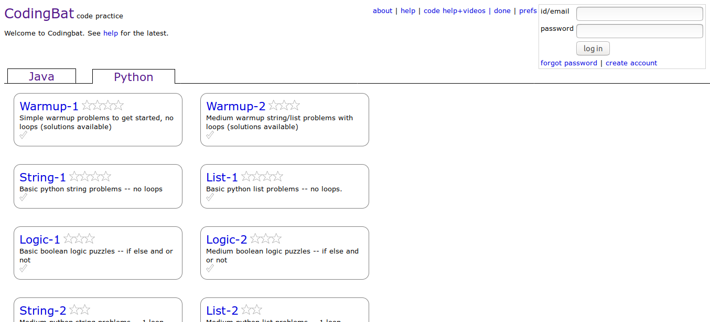
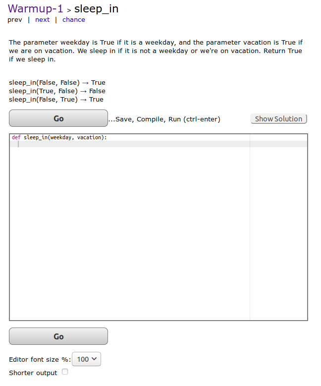

# web-scrapping

Web scraping, web harvesting, or web data extraction is data scraping used for extracting data from websites

### Customer Report:

Find out the product list (A-Z) available on the website as well as there link ex. Air Conditioners, Air Filters etc.

**Tool Used** : Beautiful Soup

### CodingBat Probelem:

Find out the programing problem statement give on the website COdingBat in standard format i.e. proper folder for every section (like string, list). Here we go, 

warmup section following problem

problem statement

