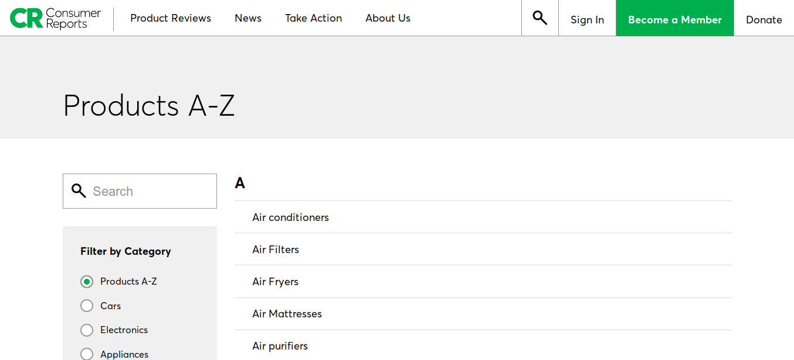
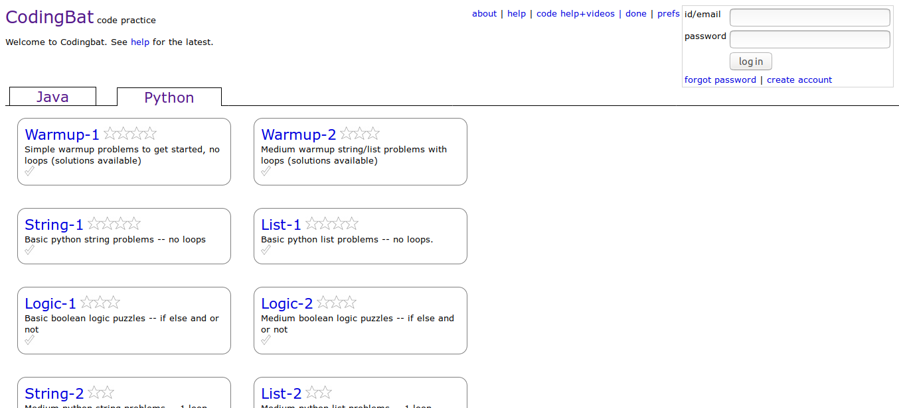
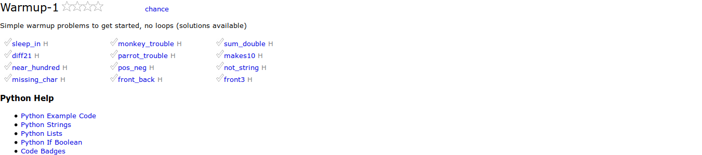
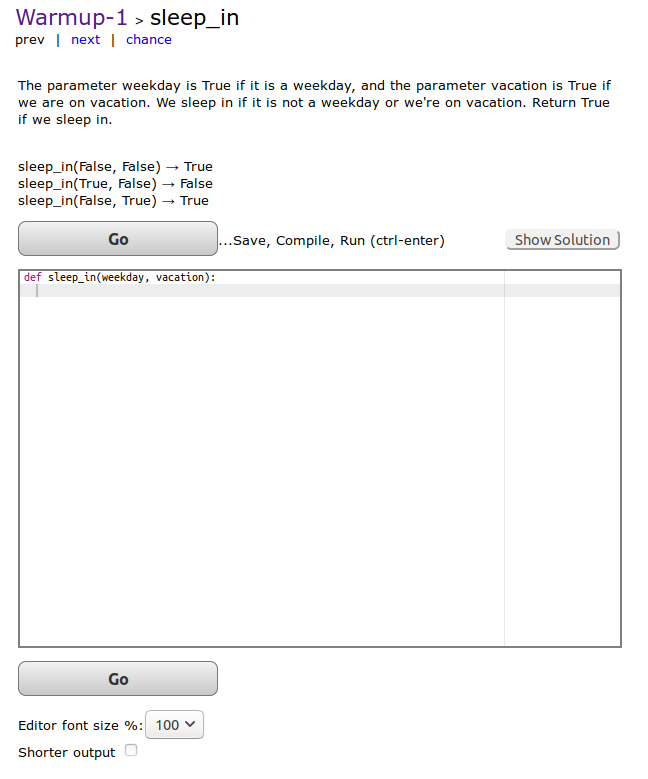
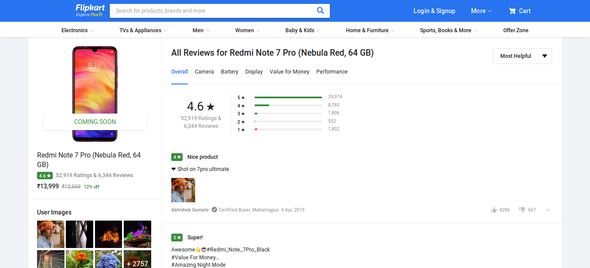

# web-scrapping

Web scraping, web harvesting, or web data extraction is data scraping used for extracting data from websites

### Customer Report:

Find out the product list (A-Z) available on the website as well as there link ex. Air Conditioners, Air Filters etc.

**Tool Used** : Beautiful Soup

### CodingBat Probelem:

Find out the programing problem statement give on the website CodingBat in standard format i.e. proper folder for every section (like string, list). Here we go, 

**1. warmup section following problem**

**2. problem statement**

**Tool Used** : Beautiful Soup

### Customer Review:
 
Seaarch the product in the flipkart get the customer review of product in the text file. 

**Tool Used** : Beautiful Soup, Selenium

 **Approach** :
  1. Connect webdriver with e-commerce website ex flipkart using selenium
  2. Using different syntax to redirect to all review page of product
  3. With beatuiful soup extract the all the reviews in a page.
  4. Since Url contain only change in page no. using this move to next page and do same.
  6. To get large input requirement of the session the code.
  7. Save the review in the text file.

